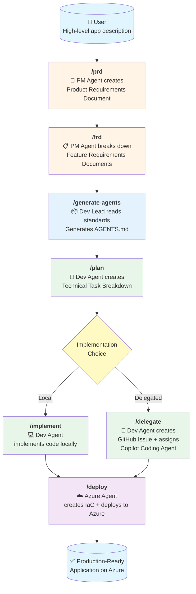

# spec2cloud

**Spec2Cloud** is an AI-powered development workflow that transforms high-level product ideas into production-ready applications deployed on Azure—using specialized GitHub Copilot agents working together.

https://github.com/user-attachments/assets/f0529e70-f437-4a14-93bc-4ab5a0450540

# Enabling a New Blueprint for Building Software

**Legend:**
- 🟪 Pre-built code
- 🟣 Code created w/ specs
- 🟨 Specs
- 🟧 Agent.md¹

---

## What it is

A **Spec** is a structured, machine-readable blueprint that defines what a solution should do (purpose, inputs, outputs) to enable consistent automation, validation, and reuse.

An **agent.md** file is like a "readme" / a manual designed for machine-readable instructions that help **coding agents** work effectively in your repo.

---

## Evolution Path

| | **Current status (Crawl)** | **Spec enhanced (Walk)** | **Full Spec ahead (Run)** |
|---|---|---|---|
| **Specs** | | 🟨🟨🟨<br/>🟧 | 🟨🟨🟨🟨 **...**<br/>🟧 |
| **Coded solution (e.g., accelerator)** | 🟪🟪🟪🟪🟪<br/>🟪🟪 | 🟣🟣🟣🟣🟣<br/>🟣🟣 | 🟣🟣🟣 Evals → 🟣🟣🟣<br/>🟣🟣🟣 Add. DB → 🟣🟣🟣 |
| **Customer requirements** | ⚫⚫⚫⚫⚫ | ⚫⚫⚫⚫⚫ | ⚫⚫⚫⚫⚫ |
| **Explanation** | Solutions delivered as rigid codebases that rarely match exact needs - require manual rework | A standardized core codebase is provided (Shell), then tailored to requirements through editable specs. | Entire solution "automatically" composed from specs, eliminating manual coding & adjustments |

---

## Advantages

- ✓ Opinionated stack
- ✓ Extensible
- ✓ Simplified maintenance, change management
- ✓ Faster time-to-PoC and time-to-prod

## 🎯 Overview

This repository provides a preconfigured development environment and agent-driven workflow that takes you from product concept to deployed application through a structured, step-by-step process.

## 🚀 Quick Start

1. **Open in Dev Container** - Everything is preconfigured in `.devcontainer/`
2. **Describe your app idea** - The more specific, the better
3. **Follow the workflow** - Use the prompts to guide specialized agents through each phase

## 🏗️ Architecture

### Development Environment

The `.devcontainer/` folder provides a **ready-to-use development container** with:
- Python 3.12


- Azure CLI & Azure Developer CLI (azd)
- TypeScript
- Docker-in-Docker
- VS Code extensions: GitHub Copilot Chat, Azure Pack, AI Studio

### MCP Servers

The `.vscode/mcp.json` configures **Model Context Protocol servers** that give agents access to:
- **context7** - Up-to-date library documentation
- **github** - Repository management and operations
- **microsoft.docs.mcp** - Official Microsoft/Azure documentation
- **playwright** - Browser automation capabilities
- **deepwiki** - Repository context and understanding for external repos

### AI Agents (Chat Modes)

Four specialized agents in `.github/chatmodes/`:

#### 1. **PM Agent** (`@pm`) - Product Manager
- **Model**: o3-mini
- **Tools**: Edit files, search, fetch web content
- **Purpose**: Translates ideas into structured PRDs and FRDs
- **Instructions**: Asks clarifying questions, identifies business goals, creates living documentation

#### 2. **Dev Lead Agent** (`@dev-lead`) - Technical Lead
- **Model**: Claude Sonnet 4
- **Tools**: Read files, search, semantic analysis  
- **Purpose**: Reviews architecture, provides technical guidance, ensures adherence to `AGENTS.md`
- **Instructions**: Analyzes engineering patterns, reviews technical decisions, validates against standards
- **Note**: AGENTS.md is auto-generated by `apm compile`

#### 3. **Dev Agent** (`@dev`) - Developer
- **Model**: Claude Sonnet 4
- **Tools**: Full development suite + Context7, GitHub, Microsoft Docs, Copilot Coding Agent, AI Toolkit
- **Purpose**: Breaks down features into tasks, implements code, or delegates to GitHub Copilot
- **Instructions**: Analyzes specs, writes modular code, follows architectural patterns, creates GitHub issues

#### 4. **Azure Agent** (`@azure`) - Cloud Architect
- **Model**: Claude Sonnet 4
- **Tools**: Azure resource management, Bicep, deployment tools, infrastructure best practices
- **Purpose**: Deploys applications to Azure with IaC and CI/CD pipelines
- **Instructions**: Analyzes codebase, generates Bicep templates, creates GitHub Actions, uses Azure Dev CLI

## 📋 Workflow



### Workflow Steps

1. **`/prd`** - Product Requirements Document
   - PM Agent engages in conversation to understand the product vision
   - Creates `specs/prd.md` with goals, scope, requirements, and user stories
   - Living document that evolves with feedback

2. **`/frd`** - Feature Requirements Documents
   - PM Agent decomposes the PRD into individual features
   - Creates files in `specs/features/` for each feature
   - Defines inputs, outputs, dependencies, and acceptance criteria

3. **`/generate-agents`** - Generate Agent Guidelines (Optional)
   - Dev Lead Agent reads all standards from `standards/` directory
   - Consolidates engineering standards into comprehensive `AGENTS.md`
   - Can be run at project start or deferred until before `/plan` and `/implement`
   - **Must be completed before planning and implementation begins**

4. **`/plan`** - Technical Planning
   - Dev Agent analyzes FRDs and creates technical task breakdowns
   - Creates files in `specs/tasks/` with implementation details
   - Identifies dependencies, estimates complexity, defines scaffolding needs

5. **`/implement`** OR **`/delegate`** - Implementation
   - **Option A (`/implement`)**: Dev Agent writes code directly in `src/backend` and `src/frontend`
   - **Option B (`/delegate`)**: Dev Agent creates GitHub Issues with full task descriptions and assigns to GitHub Copilot Coding Agent
   
6. **`/deploy`** - Azure Deployment
   - Azure Agent analyzes the codebase
   - Generates Bicep IaC templates
   - Creates GitHub Actions workflows for CI/CD
   - Deploys to Azure using Azure Dev CLI and MCP tools

## 📁 Documentation Structure

The workflow creates living documentation:

```
specs/
├── prd.md              # Product Requirements Document
├── features/           # Feature Requirements Documents
│   ├── feature-1.md
│   └── feature-2.md
└── tasks/              # Technical Task Specifications
    ├── task-1.md
    └── task-2.md

src/
├── backend/            # Backend implementation
└── frontend/           # Frontend implementation

apm_modules/            # APM packages (engineering standards)
├── azure-standards/    # General Azure & engineering standards
├── python-backend/     # Python backend standards (optional)
└── react-frontend/     # React frontend standards (optional)

AGENTS.md               # Root guidelines (generated by apm compile)
apm.yml                 # APM package manifest
mkdocs.yml              # MKdocs configuration for documentation site
docs/                   # MKdocs documentation source files
```

### Documentation with MKdocs

This repository is configured with **MKdocs** for generating beautiful project documentation:

- **Configuration**: `mkdocs.yml` contains site settings and navigation
- **Source Files**: Documentation markdown files in `docs/` directory
- **Standards**: Documentation practices defined in `standards/general/documentation-guidelines.md`
- **Build & Serve**: Use MKdocs commands to preview and deploy documentation

The documentation standards ensure consistency, accessibility, and maintainability across all project documentation.

## 📦 Managing Standards with APM

This repository uses **[APM (Agent Package Manager)](https://github.com/danielmeppiel/apm)** for managing engineering standards. APM provides:

- ✅ **Zero-config setup** - `apm install` reads `apm.yml` and installs all dependencies
- ✅ **Semantic versioning** - Lock to specific versions or use latest
- ✅ **Automatic AGENTS.md** - `apm compile` generates guardrails from all packages
- ✅ **Mix any standards** - Combine Microsoft, community, and custom packages
- ✅ **One-command updates** - `apm update` to get latest standards

### Built-in Standards

By default, spec2cloud includes:
- **azure-standards** - General engineering, documentation, agent-first patterns, CI/CD, security

### Adding More Standards

Edit `apm.yml` to add technology-specific standards:

```yaml
dependencies:
  apm:
    - EmeaAppGbb/azure-standards@1.0.0
    - EmeaAppGbb/python-backend@1.0.0  # Add Python backend rules
    - EmeaAppGbb/react-frontend@1.0.0  # Add React frontend rules
```

Then run:

```bash
apm install  # Install new packages
apm compile  # Regenerate AGENTS.md with new standards
```

### Creating Custom Standards

Create your own APM package:

```bash
my-standards/
├── apm.yml
├── README.md
└── .apm/
    └── instructions/
        ├── api-design.instructions.md
        ├── database-patterns.instructions.md
        └── security-rules.instructions.md
```

Install from any GitHub repo:

```bash
# Public repo
apm install your-org/your-standards

# Private repo (requires GITHUB_APM_PAT)
export GITHUB_APM_PAT=your_token
apm install your-org/private-standards
```

### Updating Standards

```bash
# Update all packages to latest
apm update

# Update specific package
apm update danielmeppiel/azure-standards

# Regenerate AGENTS.md after updates
apm compile
```

## 🎓 Example Usage

```bash
# Start with your product idea
"I want to create a smart AI agent for elderly care that tracks vitals and alerts caregivers"

# Step 1: Create the PRD
/prd

# Step 2: Break down into features
/frd

# Step 3: Generate agent guidelines from standards (optional, can defer)
/generate-agents

# Step 4: Create technical plans
/plan

# Step 5a: Implement locally
/implement

# OR Step 5b: Delegate to GitHub Copilot
/delegate

# Step 6: Deploy to Azure
/deploy
```

## 🔑 Key Benefits

- **Zero Setup** - Dev container has everything preconfigured
- **Structured Process** - Clear workflow from idea to production
- **AI-Powered** - Specialized agents handle different aspects
- **Best Practices** - Built-in architedtural guidance via `AGENTS.md` 
- **Flexible Standards** - Choose local development or delegation
- **Composable** - Add only the standards you need (Python, React, .NET, etc.)
- **Versioned** - Lock to specific standard versions or use latest
- **Azure-Ready** - Automated IaC and CI/CD generation

## 📖 Learn More

- See `AGENTS.md` for comprehensive engineering guidelines
- Explore `.github/chatmodes/` for agent configurations
- Review `.github/prompts/` for prompt templates

## 🤝 Contributing

Contributions welcome! Extend with additional agents, prompts, or MCP servers.

---

**From idea to production in minutes, not months.** 🚀
